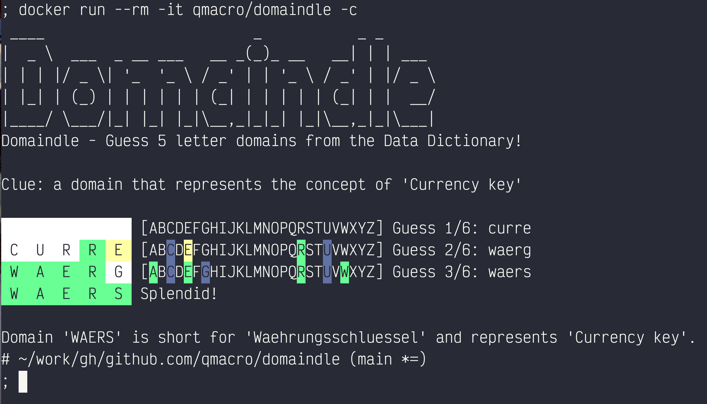

```
 ____                        _           _ _
|  _ \  ___  _ __ ___   __ _(_)_ __   __| | | ___
| | | |/ _ \| '_  '_ \ / _' | | '_ \ / _' | |/ _ \
| |_| | (_) | | | | | | (_| | | | | | (_| | |  __/
|____/ \___/|_| |_| |_|\__,_|_|_| |_|\__,_|_|\___|
```

Domaindle - Guess 5 letter domains from the Data Dictionary!

## Running it

You can clone and run it locally, or just run the Docker image as a container. Either way, you can
start out by using the `--clue` (or `-c`) option to get it to give you a clue as to which domain it is.

Here's an example session, running `domaindle` as a container:



### Locally

Clone this repo, change directory into the clone, and run the Bash script:

```bash
git clone https://github.com/qmacro/domaindle.git \
&& cd domaindle \
&& ./domaindle --clue
```

### As a container

```bash
docker run --rm -it qmacro/domaindle --clue
```

### Source domains

There are very few domains in the [database](domains.csv) initially; feel free to create a PR to contribute one or more of your favourite classic 5-letter domain names
from the Data Dictionary.

---

Inspired by the lovely folks and code in this Gist thread: [Wordle in less than 50 lines of Bash](https://gist.github.com/huytd/6a1a6a7b34a0d0abcac00b47e3d01513).
